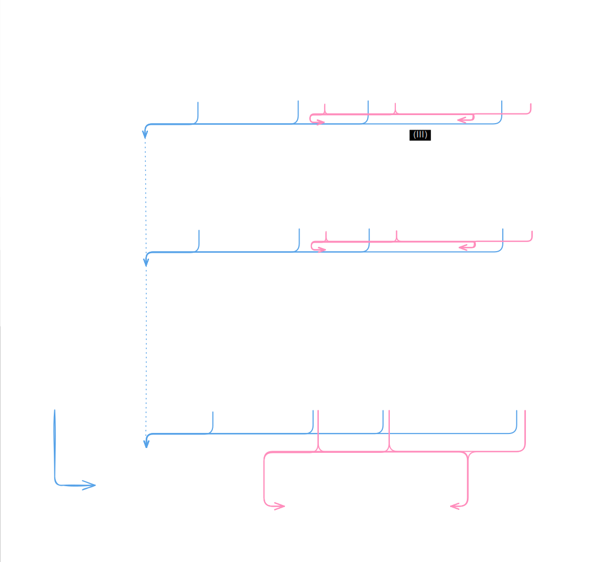

# ZoharCore - MMO Game Server



## Architecture

- **Orchestration**: [Agones](https://agones.dev) manages game server pod lifecycles and dynamic port allocation.
- **Simulation**: Headless [Bevy](https://bevyengine.org) ECS decoupled from Tokio async I/O via lock-free channels.
- **Spatial Engine**: 2D spatial hash grid for Area of Interest (AOI), with raycasting and A* pathfinding over precomputed reachability views.
- **Networking**: TCP server with typestate FSM connection pipeline enforcing strict protocol state transitions (`Handshake` -> `Login` -> `Select` -> `Loading` -> `InGame`).
- **Routing**: Stateless auth service issues HMAC-SHA256 tokens; gateways route clients to map pods via Kubernetes API lookups. Inter-node handoffs use atomic PostgreSQL session claims.
- **Data Layer**: Static game content (SQLite) baked into container images. Mutable state and global event routing rely on PostgreSQL.

## Workspace crates

- [`zohar-authsrv`](./crates/zohar-authsrv) / [`zohar-gamesrv`](./crates/zohar-gamesrv) / [`zohar-core`](./crates/zohar-core) - Service entrypoints and K8s integration.
- [`zohar-net`](./crates/zohar-net) - Async Tokio transport and typestate FSM pipelines.
- [`zohar-protocol`](./crates/zohar-protocol) - Binary serialization and protocol packet definitions.
- [`zohar-sim`](./crates/zohar-sim) - Headless Bevy ECS, spatial indexing, and game logic.
- [`zohar-db`](./crates/zohar-db) - Postgres RDBMS operations for accounts, characters, and distributed session management.
- [`zohar-content`](./crates/zohar-content) - SQLite immutable content querying.
- [`zohar-domain`](./crates/zohar-domain) - Shared domain models.

## Local development

Requires [Tilt](https://tilt.dev) and a local Kubernetes cluster (e.g., OrbStack).

```sh
tilt ci
```
